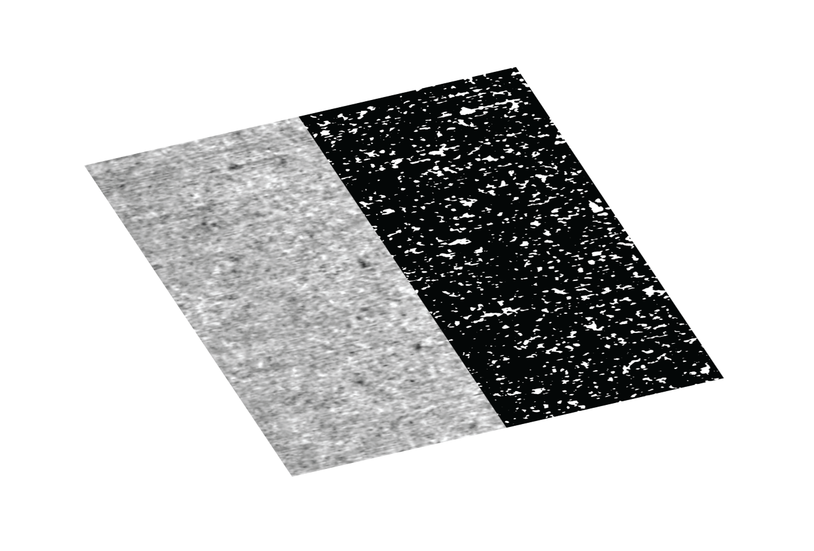

# Phansalkar local image thresholding
Phansalkar binarization method is a modification of Sauvola's thresholding method to deal with low contrast images.

The Phansalkar method is described in:

N. Phansalkar, S. More, A. Sabale, and M. Joshi, "Adaptive local thresholding for detection of nuclei in diversity stained cytology images," in 2011 International Conference on Communications and Signal Processing, 2011, pp. 218-220: IEEE.

usage:

```matlab
call_phansalkar()
```

Cite As

Bélanger Nzakimuena, C. (2020). Automated Analysis of Retinal and Choroidal OCT and OCTA Images in AMD (Masters thesis, Polytechnique Montréal). Retrieved from https://publications.polymtl.ca/5234/


